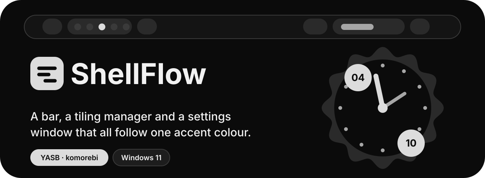
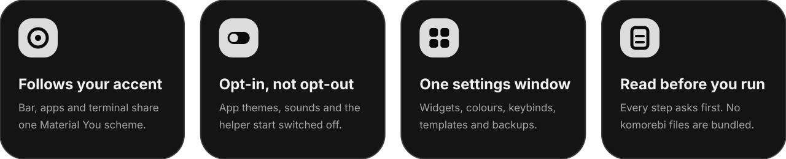

<div align="center">


<picture>
  <source media="(prefers-color-scheme: dark)" srcset="assets/banner-dark.svg">
  <source media="(prefers-color-scheme: light)" srcset="assets/banner-light.svg">
  
</picture>

<br>


</div>

<br>

<picture>
  <source media="(prefers-color-scheme: dark)" srcset="assets/features-dark.svg">
  <source media="(prefers-color-scheme: light)" srcset="assets/features-light.svg">
  
</picture>

<br>

## ✦ Install

Open PowerShell as a **normal user** (not administrator) and run:

```powershell
irm https://raw.githubusercontent.com/ProgrammerManSudjo/shellflow/main/install.ps1 | iex
```

It installs [scoop](https://scoop.sh), then **komorebi**, **whkd** and **YASB** from their official packages, and asks before it installs
ShellFlow and the starter config. **Every step asks yes or no first.** It works in your own user profile
(`%USERPROFILE%\.config\yasb` and komorebi's own files).

<details>
<summary><b>Install everything without asking</b> (dangerous)</summary>

<br>

```powershell
irm https://raw.githubusercontent.com/ProgrammerManSudjo/shellflow/main/install-all.ps1 | iex
```

> [!CAUTION]
> **Always read scripts you find online before you run them.** This one installs everything without asking (scoop, komorebi, whkd, YASB,
> a font, Python, ShellFlow, the config, wallpapers, the terminal tools and their configs, a block in your PowerShell profile) and changes
> your user profile. It makes you type `I HAVE READ THE SCRIPTS` first, and it never replaces a config file you already have.
> Both scripts are plain text: [`install-all.ps1`](install-all.ps1) · [`install.ps1`](install.ps1).

</details>

> [!NOTE]
> komorebi and whkd are free for **personal use only** (the Komorebi License). Using them at work needs a paid licence:
> <https://lgug2z.com/software/komorebi>. They are installed from their official packages and are **not** part of this repository.

<br>

## ✦ What you get

| | |
| :-- | :-- |
| **A bar** | [YASB](https://github.com/amnweb/yasb) with a starter config: capsules, workspaces, taskbar, clock and a power menu |
| **A tiler** | [komorebi](https://github.com/LGUG2Z/komorebi) and [whkd](https://github.com/LGUG2Z/whkd), with komorebi's own example config |
| **A settings window** | **ShellFlow**: widgets, colour schemes, keybinds, templates, backups. Open it from the Home button on the bar |
| **Colours** | Material You schemes from your wallpaper or your Windows accent. Out of the box the bar simply follows your Windows accent |
| **Wallpapers** | A small collection, copied to `Pictures\Wallpapers` |
| **Terminal** *(optional)* | yazi, neovim, fzf and friends with starter configs; fzf takes your accent colour |

<br>

## ✦ Off by default

App themes (Discord, Zed, Obsidian, Firefox, ...), all sounds and the background helper start **switched off**. Switch on only what you want in
**ShellFlow → Templates**. The bar follows your Windows accent colour and nothing else is touched.

<br>

## ✦ Check out these awesome projects as well

ShellFlow can write colour themes for these once you have installed them. The installer only prints the links.

| Project | |
| :-- | :-- |
| **Equicord** · Discord client mod | <https://github.com/Equicord/Equicord> |
| **midnight** · Discord theme | <https://github.com/refact0r/midnight-discord> |
| **File Pilot** · file manager | <https://filepilot.tech> |
| **Helium** · Chromium browser | <https://github.com/imputnet/helium> |
| **Zen Browser** · Firefox-based browser | <https://zen-browser.app> |
| **Windhawk** · Windows mods, taskbar styling | <https://github.com/ramensoftware/windhawk/releases> |
| **Rainmeter** · desktop widgets and clocks | <https://www.rainmeter.net> |
| **Zed** · editor | <https://zed.dev> |
| **Obsidian** · notes | <https://obsidian.md> |
| **Yazi** · terminal file manager | <https://yazi-rs.github.io> |
| **Tacky Borders** · window borders | <https://github.com/lukeyou05/tacky-borders> |
| **OBS Studio** · recording and streaming | <https://obsproject.com> |

<br>

## ✦ What is in this repo

| Folder | What | Goes to |
| :-- | :-- | :-- |
| `shellflow/` | `theme.py`, `settings.py` | `%USERPROFILE%\.config\yasb\scripts` |
| `defaults/yasb/` | starter `config.yaml`, `styles.css`, `.env` | `%USERPROFILE%\.config\yasb` |
| `wallpapers/` | images (png, jpg, webp, bmp) | `%USERPROFILE%\Pictures\Wallpapers` |
| `terminal/` | Neovim, Yazi and PowerShell (fzf, zoxide) configs | `%LOCALAPPDATA%\nvim`, `%APPDATA%\yazi\config`, your PowerShell profile |
| `assets/` | the artwork in this README | not installed |

<br>

<details>
<summary><b>For the maintainer</b>: updating this repo</summary>

<br>

1. When ShellFlow changes, copy the new `theme.py` and `settings.py` into `shellflow/`, then:
   ```powershell
   git add . ; git commit -m "update" ; git push
   ```
2. A big wallpaper collection: zip the images as `wallpapers.zip`, attach it to a GitHub Release (`gh release create v1 wallpapers.zip`) and set
   `$WallpapersUrl` in `install.ps1` to `https://github.com/ProgrammerManSudjo/shellflow/releases/latest/download/wallpapers.zip`.
   Don't use Git LFS for them: GitHub's zip and raw downloads give LFS files as small pointer files, not the images.
3. Test in a Windows virtual machine **with a standard (non-administrator) user**. Windows Sandbox does not work: its account is an administrator, and the
   installer refuses to run elevated. To test a change before pushing, run `.\install.ps1` from the folder: it uses the local files.
4. Repository social preview: *Settings → General → Social preview →* upload `assets/social-preview.png`.

</details>

<br>

<div align="center">

<sub>MIT licensed · komorebi and whkd are under the Komorebi License (personal use only) · made with ♥ and a lot of accent colours</sub>

</div>
